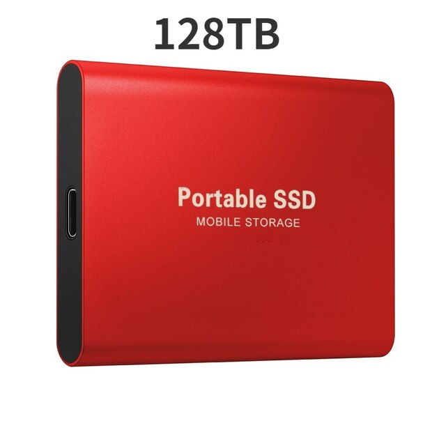

#Manual Markdown 
====================================
##**by Артем Анатольевич Авдеев**
###*2022 г. Челябинск*

---
1.**git init** - *это инициализация каталога для git.*
2.**git version** *- показывет номер текущей версии git на вашем пк.*
3.**git add**  - *добавляет файл/группу файлов в репозитарий git.*

---
**Полужирный шрифт**
__Полужирный__

*Курсивный шрифт*
_Курсивный_

~~Зачеркнутый~~
==Выделенный==

---
#Заголовок
##Подзаголовок
###Под-подзаголовок
####Под-под-под заголовок

---
1. Нумерованный список
2. Нумерованный список
3. Нумерованный список
3.1. Нумерованный список
3.2. Нумерованный список

---
* Маркированный список
* Маркированный список
* * Маркированный список
* * * Маркированный список
  
- Маркированный список
+ Маркированный список

---
**git diff** - *показывает разницу между текущим файлом и сохраненным*
**git checkout** - *позволяет переходить между версиями*
**git log** - *показывает журнал сохранений*
**git commit** - *фиксирует и сохраняет данные, в т.ч. комментарии*
**git status** - *показывает текущее состояние репозитария*

---
(www.google.com) - ссылка на url.
(avdeevart@bk.ru) - ссылка на почтовый ящик.
[ссылка через ID](www.google.com) на Google

---
Картиночка моего MSSD

---
>**Цитата:** *Все, что меня не убивает, то делает сильнее.*

---
|Таблица|Ячейка|
[ ] Чек-лист

---